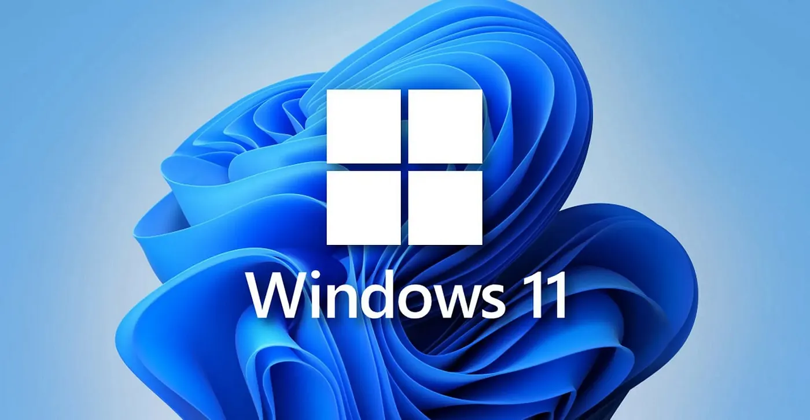

I want to start installing Windows 10, but I recently read an update from Microsoft stating that Windows 10 will no longer receive free software updates, technical support or security fixes after 14 October 2025. This means that Windows 10 will reach the end of its support period.

Before installation, ensure that your device meets the requirements. Then, create a bootable drive using the Media Creation Tool and Rufus. If you would like to install Windows 11 directly onto your device, you can use the Installation Assistant, but make sure you back up your data first.

#### Create a bootable using Media Creation Tool
1. Download Media Creation here https://go.microsoft.com/fwlink/?linkid=2156295
2. Run the file as Administrator, then select a correct USB flash drive

#### Create a bootable using Rufus
1. Download Rufus here https://rufus.ie/en/
2. Run the file as Administrator, make sure your windows like this:

#### Essential Apps to Install
If you are new to Windows installations, these are the essential apps you will need to install:

1. Browser
Chrome, Mozilla, Brave.
2. File Archiver
7-Zip, WinRAR, etc.
3. Media Player
VLC Media Player
4. Remote Desktop Apps
Anydesk, UltraViewer, etc.
5. Office Suite
LibreOffice, OnlyOffice, etc.

