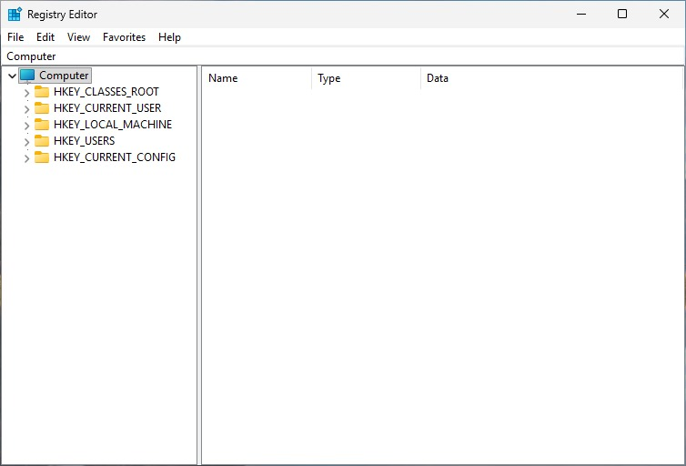

##### System Configuration
System Configuration will help you to resolving issues, monitoring performance, making a configuration, checking the running servics, etc. You can launch the tools to make sure what you will do with this feature.

You can use this shortut to open the tools by type Windows + Run and enter specific command like this:
- Services -> services.msc
- Registry -> regedit
- Programs -> appwizz.cpl
- Network Connectiomn -> ncpa.cpl
- Command Prompt -> cmd
- Direct X Troubleshooter -> dxdiag
- Windows Version -> winver
- User Account -> netplwiz

##### Task Manager
You can monitor your application by resource usage here and background processes that running in your windows.

##### Services
You can check the services running or the services that you don't expected to be running here. I have had use this so much when I faced printing issue by restart the *print spooler* service back then.

##### Registry
I have also had a much issue with the passbook printer not working because sometimes the default printer names has changed, removed, and even I installed a new one but the printer still not response because the old name still there on the registry. So, I removed the printer name in the *registry* then reinstalled it.

